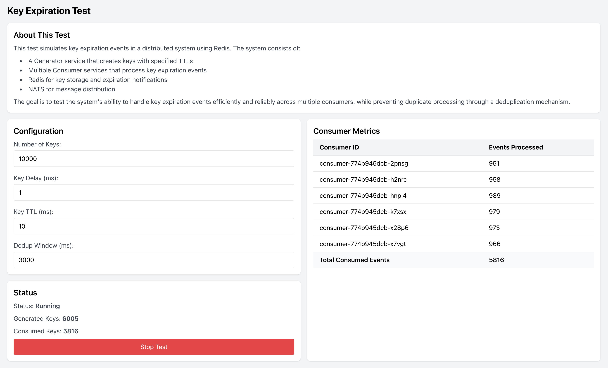

# Key Expiration Test Workgroup

[](https://opensource.org/licenses/MIT)

This project implements a distributed system to test and analyze key expiration events in Redis, focusing on efficient event processing and deduplication across multiple consumers.



## System Components

- **Generator Service**: Creates Redis keys with specified TTLs
- **Consumer Service**: Processes key expiration events with deduplication
- **Redis**: Stores keys and provides key expiration notifications
- **NATS**: Handles message distribution using WorkQueue policy for even load distribution

## Architecture

1. The Generator creates keys in Redis with specified TTLs
2. When keys expire, Redis publishes expiration events
3. Consumers receive these events and use a deduplication mechanism to ensure each event is processed only once
4. NATS JetStream with WorkQueue policy ensures even distribution of processed events among consumers

## Prerequisites

- Docker
- Kubernetes cluster (local development uses Docker Desktop's Kubernetes)
- kubectl
- Node.js (for UI development)
- Go 1.21+

## Setup

1. Clone the repository:
```bash
git clone https://github.com/mxcoppell/load-balanced-event-deduplication-pipeline.git
cd load-balanced-event-deduplication-pipeline
```

2. Build the services:
```bash
# Build the WebUI and generator service
cd web && npm install && npm run build && cd ..
docker build -t generator:latest -f docker/Dockerfile.generator .

# Build the consumer service
docker build -t consumer:latest -f docker/Dockerfile.consumer .
```

3. Deploy to Kubernetes:
```bash
# Deploy Redis
kubectl apply -f k8s/redis/deployment.yaml

# Deploy NATS
kubectl apply -f k8s/nats/deployment.yaml

# Deploy generator service
kubectl apply -f k8s/generator/deployment.yaml

# Deploy consumer service
kubectl apply -f k8s/consumer/deployment.yaml
```

## Usage

1. Access the WebUI at `http://localhost:30080`

2. Configure test parameters:
   - Number of Keys: Total keys to generate
   - Key Delay (ms): Delay between key generations
   - Key TTL (ms): Time-to-live for each key
   - Dedup Window (ms): Duration for deduplication window

3. Click "Start Test" to begin the test

4. Monitor the results:
   - Generated Keys: Total keys created
   - Consumed Keys: Total keys processed
   - Consumer Metrics: Distribution of processed events across consumers

## Development

### Project Structure

```
.
├── cmd/
│   ├── consumer/   # Consumer service implementation
│   └── generator/  # Generator service implementation
├── docker/         # Dockerfiles
├── k8s/            # Kubernetes manifests
├── pkg/
│   ├── nats/       # NATS client implementation
│   └── redis/      # Redis client implementation
└── web/            # Web UI implementation
```

### Building Changes

1. After modifying the Go code:
```bash
docker build -t generator:latest -f docker/Dockerfile.generator .
docker build -t consumer:latest -f docker/Dockerfile.consumer .
kubectl rollout restart deployment/generator deployment/consumer
```

2. For UI-only changes:
```bash
cd web && npm run build && cd ..
docker build -t generator:latest -f docker/Dockerfile.generator .
kubectl rollout restart deployment/generator
```

## License

MIT License 